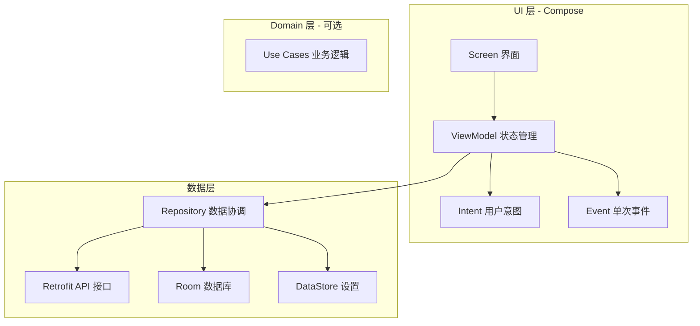
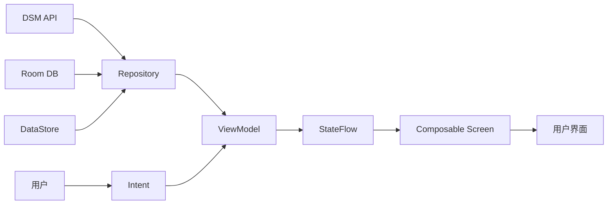

# 技术架构

## 技术栈总览

### 编程语言

| 语言 | 文件数 | 占比 |
|------|--------|------|
| Kotlin | 402 | 93.5% |
| XML | 15 | 3.5% |
| Markdown | 9 | 2.1% |
| JSON | 2 | 0.5% |
| TOML | 1 | 0.2% |
| YAML | 1 | 0.2% |

### 框架与库

**核心依赖**（来自 `gradle/libs.versions.toml`）：

| 库 | 版本 | 用途 |
|------|------|------|
| Kotlin | 2.3.10 | 开发语言 |
| Android Gradle Plugin | 8.13.2 | 构建工具 |
| Compose BOM | 2026.02.01 | Compose 版本协调 |
| Jetpack Compose UI | 2026.02.01 | 声明式 UI 框架 |
| Material 3 | 2026.02.01 | Material Design 组件 |
| Navigation Compose | 2.9.7 | 类型安全导航 |
| Lifecycle | 2.10.0 | 生命周期管理 |
| Hilt | 2.58 | 依赖注入 |
| Retrofit | 3.0.0 | HTTP 客户端 |
| OkHttp | 5.3.2 | 底层网络库 |
| Moshi | 1.15.2 | JSON 解析 |
| Coil | 2.7.0 | 图片加载 |
| Room | 2.7.0-alpha12 | 本地数据库 |
| DataStore | 1.2.0 | 设置存储 |
| Vico | 3.0.2 | 图表库 |
| MPV Android | 0.1.9 | 视频播放器 |
| SSHLib (ConnectBot) | 2.2.43 | SSH 终端 |
| TermLib | 0.0.18 | 终端模拟器 |

**测试依赖**：
- JUnit 4, MockK, Turbine, Truth
- Kotlinx Coroutines Test
- Espresso, Compose UI Test

---

## 架构分层

本项目采用 **MVI (Model-View-Intent)** 架构模式，配合清晰的分层设计：



### 各层职责

**UI 层** (`ui/`):
- `*Screen.kt`: Composable UI，接收 State 并发送 Intent
- `*ViewModel.kt`: 继承 `BaseViewModel`，处理 Intent 并更新 State
- `*Intent.kt`: 密封类，定义所有用户意图
- `*Event.kt`: 密封类，定义单次事件（如导航、Toast）

**数据层** (`data/`):
- `*Repository.kt`: 封装业务逻辑，提供给 ViewModel 调用
- `*ApiRetrofit.kt`: Retrofit API 接口定义
- `*Dao.kt`: Room 数据访问对象
- `Entity/`: 数据库实体

**依赖注入** (`di/`):
- `ApiModule`: 提供 API 接口实例
- `NetworkModule`: 提供网络客户端
- `DatabaseModule`: 提供数据库实例

---

## 架构特征分析

基于代码实际组织方式，本项目呈现以下架构特征：

### 1. MVI + 单向数据流

每个功能模块遵循严格的 MVI 模式：
```
User → Intent → ViewModel → Repository → API/DB
                    ↓
                  State → Screen → UI
                    ↓
                  Event → 一次性操作
```

**判断依据**：
- `BaseViewModel` 定义了 `StateFlow<S>`, `Flow<E>`, `sendIntent()` 接口
- 所有 ViewModel 都实现 `processIntent()` 方法
- UI 层通过 `collectAsStateWithLifecycle()` 收集状态

### 2.  Repository 模式集中管理数据

所有数据访问通过 Repository 封装：
- `BaseRepository` 提供通用错误处理
- 每个功能模块有对应的 Repository
- Repository 负责协调 API 和本地数据库

### 3. 多客户端 OkHttpClient 策略

`DsmApiHelper` 管理三个用途的 OkHttpClient：
```kotlin
lateinit var okHttpClient: OkHttpClient           // 普通 API（60s 超时，带重试）
lateinit var fileTransferClient: OkHttpClient     // 文件上传/下载（300s 超时，无重试）
lateinit var imageClient: OkHttpClient            // 图片加载（60s 超时，无重试）
```

**设计原因**：
- 文件传输需要更长超时时间
- 图片加载不需要重试逻辑
- 共享连接池和 Dispatcher 提高效率

### 4. 类型安全导航

使用 Kotlinx Serialization 实现类型安全路由：
```kotlin
object DsmRoute {
    @Serializable data class FileDetail(val path: String)
    @Serializable data class PhotoPreview(val photoId: String)
}
```

---

## 依赖关系

### app 模块依赖

```
app
├── data (API/Repository/数据库)
├── ui (所有界面与 ViewModel)
├── navigation (路由定义与导航图)
├── util (工具类：扩展函数、帮助类)
├── di (Hilt 模块)
├── terminal (SSH 终端)
└── service (前台服务：下载/上传)
```

### 模块间通信

| 源模块 | 目标模块 | 通信方式 |
|--------|----------|----------|
| UI → Data | Repository | Hilt 注入 |
| UI → Navigation | NavHostController | 参数传递 |
| Data → UI | StateFlow/Event | Flow 收集 |
| Util → All | 工具函数/单例 | 直接调用 |

---

## 数据流向



**关键数据转换**：
1. API 响应 (`@JsonClass` 模型) → Repository 转换为 UI 数据类
2. ViewModel 通过 `updateState` 更新 State
3. Composable 函数根据 State 渲染 UI

---

## MVI 架构规范

每个功能模块包含 4 个核心文件：

```
ui/
└── feature/
    ├── *Screen.kt      # Composable UI
    ├── *ViewModel.kt   # 状态管理
    ├── *Intent.kt      # 用户意图
    └── *Event.kt       # 单次事件
```

**示例（文件管理模块）**：

```kotlin
// Intent
sealed interface FileIntent {
    data class LoadFiles(val path: String) : FileIntent
    data class DeleteFile(val path: String) : FileIntent
}

// Event
sealed interface FileEvent {
    data class ShowToast(val message: String) : FileEvent
    data class NavigateToDetail(val path: String) : FileEvent
}

// State
data class FileState(
    val files: List<FileItem> = emptyList(),
    val currentPath: String = "/",
    val isLoading: Boolean = false,
    val error: String? = null
)

// ViewModel
class FileViewModel @Inject constructor(
    private val repository: FileRepository
) : BaseViewModel<FileIntent, FileState, FileEvent>() {
    override suspend fun processIntent(intent: FileIntent) {
        when (intent) {
            is FileIntent.LoadFiles -> loadFiles(intent.path)
            is FileIntent.DeleteFile -> deleteFile(intent.path)
        }
    }
}
```

---

*此文档由 AI README 分析生成*
