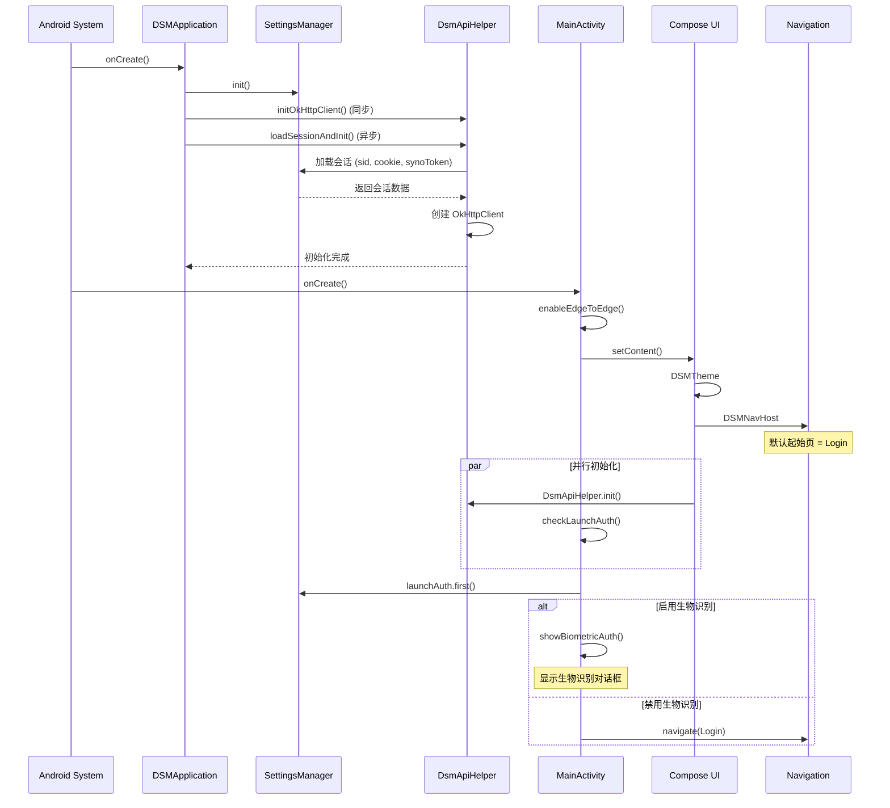
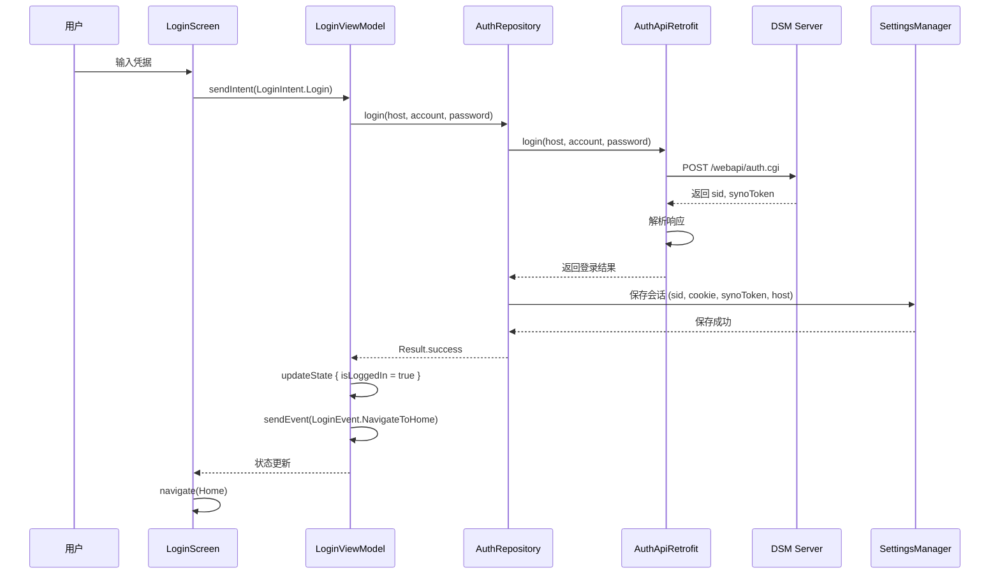
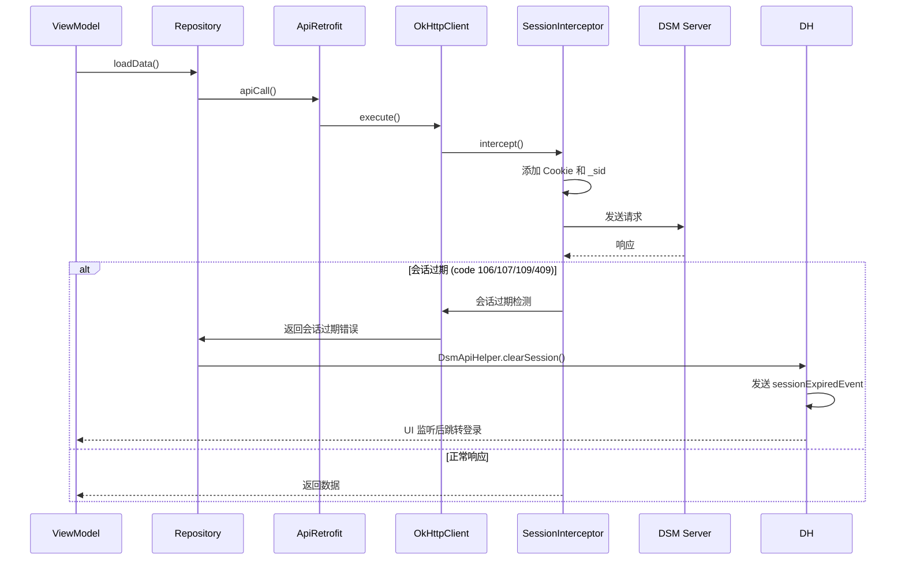
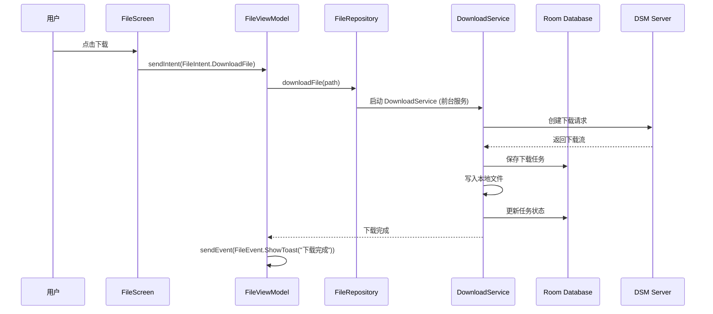
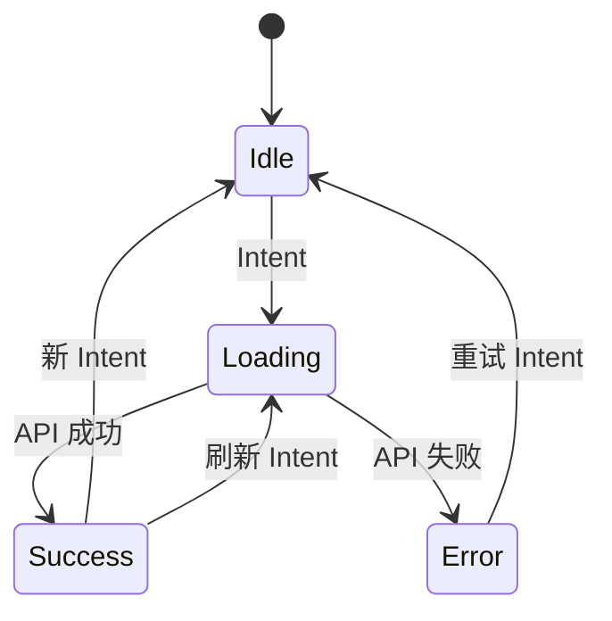
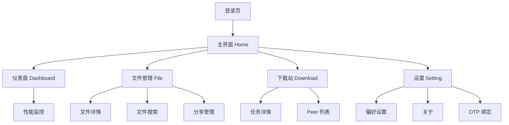

# 核心流程

## 启动流程

### 应用启动序列图



### 关键初始化步骤

1. **DSMApplication.onCreate()**:
   - 初始化 `SettingsManager`（DataStore）
   - 同步初始化 `DsmApiHelper.initOkHttpClient()`
   - 异步加载会话 `DsmApiHelper.loadSessionAndInit()`

2. **MainActivity.onCreate()**:
   - 启用 Edge-to-Edge
   - 设置 Compose 内容
   - 初始化 `DSMNavHost`（默认起始页为 Login）
   - 监听会话过期事件

3. **生物识别启动认证** (可选):
   - 从 `SettingsManager.launchAuth` 读取设置
   - 如果启用，显示生物识别对话框
   - 认证成功后进入登录页

---

## 登录流程

### 登录序列图



### 登录关键代码

```kotlin
// LoginViewModel.kt
class LoginViewModel @Inject constructor(
    private val authRepository: AuthRepository
) : BaseViewModel<LoginIntent, LoginState, LoginEvent>() {

    override suspend fun processIntent(intent: LoginIntent) {
        when (intent) {
            is LoginIntent.Login -> login(intent.host, intent.account, intent.password)
        }
    }

    private suspend fun login(host: String, account: String, password: String) {
        updateState { copy(isLoading = true) }
        val result = authRepository.login(host, account, password)
        result.onSuccess {
            updateState { copy(isLoading = false, isLoggedIn = true) }
            sendEvent(LoginEvent.NavigateToHome)
        }.onFailure {
            updateState { copy(isLoading = false, error = it.message ) }
            sendEvent(LoginEvent.ShowError(it.message))
        }
    }
}
```

---

## API 调用流程

### 带会话管理的 API 调用



### 会话拦截器

`SessionInterceptor` 自动为所有请求添加：
- Cookie（包含 sid）
- `_sid` 查询参数
- `SynoToken`（需要时）

---

## 文件下载流程

### 文件下载序列图



---

## 状态管理流程

### MVI 状态流转



### BaseViewModel 核心逻辑

```kotlin
abstract class BaseViewModel<S : BaseState, I : BaseIntent, E : BaseEvent> : ViewModel() {
    abstract val state: StateFlow<S>
    abstract val events: Flow<E>

    private val intentChannel = Channel<I>(Channel.UNLIMITED)

    init {
        viewModelScope.launch {
            intentChannel.consumeAsFlow().collect { intent ->
                processIntent(intent)
            }
        }
    }

    protected abstract suspend fun processIntent(intent: I)

    fun sendIntent(intent: I) {
        viewModelScope.launch { intentChannel.send(intent) }
    }
}
```

---

## 导航流程

### 主导航结构



### 导航切换逻辑

- 使用 `popBackStack()` 保持状态
- 如果目标路由不在栈中，使用 `navigate()`
- 已在目标路由时不做任何操作

---

*此文档由 AI README 分析生成*
