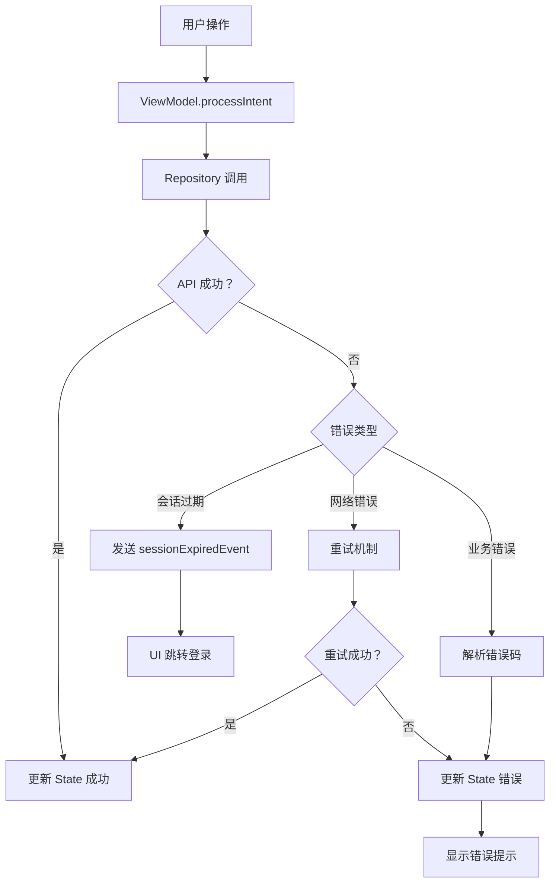

# 错误处理

## 错误处理位置

### 全局异常处理

**应用级错误处理**：
- `DSMApplication` 未注册全局异常处理器
- 依赖 ViewModel 层的 `runCatching` 捕获异常

### Repository 层错误处理

所有 Repository 方法使用 `runCatching` 统一处理：

```kotlin
// BaseRepository.kt 和各个 Repository
suspend fun loadData(): Result<Data> {
    return runCatching {
        api.call()
    }
}
```

### ViewModel 层错误处理

ViewModel 通过 `processIntent` 处理错误并更新 State：

```kotlin
override suspend fun processIntent(intent: MyIntent) {
    updateState { copy(isLoading = true) }
    val result = repository.call()
    result.onSuccess { data ->
        updateState { copy(data = data, isLoading = false) }
    }.onFailure { error ->
        updateState { copy(error = error.message, isLoading = false) }
        sendEvent(MyEvent.ShowError(error.message))
    }
}
```

---

## 错误类型定义

### 自定义异常

```kotlin
// 在 Repository 或 API 层定义
class ApiException(
    val code: Int,
    override val message: String
) : Exception(message)

class NetworkException(
    override val message: String
) : Exception(message)
```

### API 错误码

定义在 `DsmApiHelper.getApiErrorMessage()`:

**通用错误** (100-109):
| 错误码 | 含义 |
|--------|------|
| 100 | 未知错误 |
| 101 | 账户不存在 |
| 102 | 账户已禁用 |
| 103 | 密码错误 |
| 104 | 权限不足 |
| 105 | 服务不可用 |
| 106 | 会话超时 |
| 107 | 会话中断 |
| 109 | 会话不存在 |

**登录错误** (400-417):
- 400: 凭据错误
- 401: 账户已禁用
- 403: 需要 OTP
- 409: 会话过期
- 410: 账户已锁定

**文件操作错误** (1000-1009):
- 1000: 文件未找到
- 1001: 文件夹未找到
- 1002: 文件已存在
- 1006: 权限不足
- 1007: 存储空间不足

**下载站错误** (4000-4003):
- 4000: 任务未找到
- 4001: 任务创建失败
- 4002: 无效下载链接

---

## 日志和监控

### 日志框架

使用 Android 原生 `Log` 类：

```kotlin
private const val TAG = "DsmApiClient"

Log.d(TAG, "Debug message")
Log.i(TAG, "Info message")
Log.w(TAG, "Warning message")
Log.e(TAG, "Error message", exception)
```

### SafeLoggingInterceptor

网络日志拦截器，支持脱敏敏感信息：

```kotlin
// DsmApiHelper.kt
private class SafeLoggingInterceptor : Interceptor {
    enum class Level { NONE, HEADERS, BODY }
    var level: Level = Level.NONE

    override fun intercept(chain: Interceptor.Chain): Response {
        // 脱敏 sid, cookie, synoToken 等敏感信息
        // 仅在 Debug 模式启用
    }
}
```

### 日志级别配置

```kotlin
// 仅在 Debug 构建启用详细日志
if (BuildConfig.DEBUG) {
    level = SafeLoggingInterceptor.Level.BODY
} else {
    level = SafeLoggingInterceptor.Level.NONE
}
```

---

## 错误处理流程

### 整体错误处理流程



### 网络重试机制

```kotlin
// DsmApiHelper.RetryInterceptor
private class RetryInterceptor(
    private val maxRetryCount: Int = 3
) : Interceptor {
    override fun intercept(chain: Interceptor.Chain): Response {
        var retryCount = 0
        while (retryCount <= maxRetryCount) {
            try {
                val response = chain.proceed(request)
                if (response.isSuccessful) return response
                // 5xx 错误重试
                if (response.code in 500..599) {
                    retryCount++
                    Thread.sleep(1000L * retryCount)
                    continue
                }
                return response
            } catch (e: IOException) {
                retryCount++
                if (retryCount <= maxRetryCount) {
                    Thread.sleep(1000L * retryCount)
                    continue
                }
                throw e
            }
        }
        throw IOException("Unknown error")
    }
}
```

### 会话过期自动处理

```kotlin
// 1. 检测会话过期
private val SESSION_EXPIRED_CODES = setOf(106, 107, 109, 409)

// 2. 发送事件
val sessionExpiredEvent: SharedFlow<Unit> = _sessionExpiredEvent.asSharedFlow()

// 3. UI 监听并跳转
LaunchedEffect(Unit) {
    DsmApiHelper.sessionExpiredEvent
        .onEach {
            navController.navigate(DsmRoute.Login) {
                popUpTo(0) { inclusive = true }
            }
        }
        .launchIn(this)
}
```

---

## 用户错误提示

### 错误提示方式

1. **SnackBar**: 轻量错误提示
2. **Dialog**: 重要错误确认
3. **Toast**: 短暂提示

### 错误消息映射

```kotlin
// DsmApiHelper.getApiErrorMessage(code: Int): String
fun getApiErrorMessage(code: Int): String {
    return when (code) {
        103 -> "密码错误"
        106 -> "会话已超时"
        1000 -> "文件未找到"
        // ...
        else -> "未知错误 (代码：$code)"
    }
}
```

---

*此文档由 AI README 分析生成*
