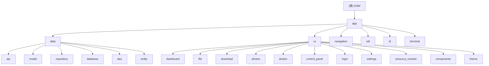

# DSM - Synology DSM Android 客户端

## 变更记录 (Changelog)

### 2026-03-05 18:07:29
- 初始化 AI 上下文文档
- 完成项目架构分析与模块识别
- 生成根级与模块级文档

---

## 项目愿景

DSM 是一个功能完整的 Synology DSM Android 客户端应用，旨在为用户提供便捷的移动端 NAS 管理体验。应用采用现代化的 Android 开发技术栈，使用 Kotlin + Jetpack Compose 构建，遵循 MVI（Model-View-Intent）架构模式，提供流畅、直观的用户界面。

核心功能包括：
- 仪表盘监控（系统资源、存储、网络等）
- 文件管理（浏览、上传、下载、分享）
- 照片管理（相册浏览、照片预览）
- 下载站管理（任务管理、BT/磁力链接）
- Docker 容器管理
- 控制面板（用户、共享文件夹、网络、存储等）
- SSH 终端
- 系统信息与性能监控

---

## 架构总览

### 技术栈
- **语言**: Kotlin 2.3.10
- **UI 框架**: Jetpack Compose (BOM 2026.02.01)
- **架构模式**: MVI (Model-View-Intent)
- **依赖注入**: Hilt 2.58
- **网络**: Retrofit 3.0.0 + OkHttp 5.3.2
- **JSON 解析**: Moshi 1.15.2
- **图片加载**: Coil 2.7.0
- **数据持久化**: Room 2.7.0-alpha12 + DataStore 1.2.0
- **导航**: Navigation Compose 2.9.7
- **图表**: Vico 2.4.3
- **视频播放**: MPV Android 0.1.9
- **SSH**: ConnectBot sshlib 2.2.43 + termlib 0.0.18

### 架构分层
```
┌─────────────────────────────────────────┐
│           UI Layer (Compose)            │
│  - Screen (UI 渲染)                     │
│  - ViewModel (状态管理 + Intent 处理)   │
│  - Intent (用户意图)                    │
│  - Event (单次事件)                     │
└─────────────────────────────────────────┘
                    ↓
┌─────────────────────────────────────────┐
│         Domain Layer (可选)             │
│  - Use Cases (业务逻辑)                 │
└─────────────────────────────────────────┘
                    ↓
┌─────────────────────────────────────────┐
│           Data Layer                    │
│  - Repository (数据协调)                │
│  - API (Retrofit 接口)                  │
│  - Database (Room)                      │
│  - DataStore (设置存储)                 │
└─────────────────────────────────────────┘
```

---

## 模块结构图



---

## 模块索引

| 模块路径 | 职责 | 关键文件 |
|---------|------|---------|
| `app/src/main/java/wang/zengye/dsm/data` | 数据层：API、Repository、数据库 | DsmApiClient.kt, *Repository.kt, AppDatabase.kt |
| `app/src/main/java/wang/zengye/dsm/ui` | UI 层：所有界面与 ViewModel | *Screen.kt, *ViewModel.kt, *Intent.kt, *Event.kt |
| `app/src/main/java/wang/zengye/dsm/navigation` | 导航管理：路由定义与导航图 | Navigation.kt, *Navigation.kt |
| `app/src/main/java/wang/zengye/dsm/util` | 工具类：扩展函数、帮助类 | Extensions.kt, SettingsManager.kt, BiometricHelper.kt |
| `app/src/main/java/wang/zengye/dsm/di` | 依赖注入：Hilt 模块 | ApiModule.kt, NetworkModule.kt, DatabaseModule.kt |
| `app/src/main/java/wang/zengye/dsm/terminal` | SSH 终端：终端模拟器与服务 | TerminalEmulator.kt, TerminalService.kt |
| `app/src/test` | 单元测试 | *Test.kt |
| `app/src/androidTest` | UI 测试 | *Test.kt |

---

## 运行与开发

### 环境要求
- Android Studio Ladybug (2024.2.1) 或更高版本
- JDK 17
- Android SDK 36 (compileSdk)
- 最低支持 Android 7.0 (API 24)

### 构建命令
```bash
# 调试版本
./gradlew assembleDebug

# 发布版本（多架构 APK）
./gradlew assembleRelease

# 运行单元测试
./gradlew test

# 运行 UI 测试
./gradlew connectedAndroidTest
```

### 多架构编译
项目配置了 ABI 分离编译，会生成以下 APK：
- `app-armeabi-v7a-release.apk`
- `app-arm64-v8a-release.apk`
- `app-x86-release.apk`
- `app-x86_64-release.apk`
- `app-universal-release.apk` (包含所有架构)

### 开发服务器
应用需要连接到 Synology DSM 服务器，支持 HTTP/HTTPS 协议。开发时需要：
1. 确保设备与 DSM 服务器在同一网络
2. 在登录界面输入 DSM 地址（如 `http://192.168.1.100:5000`）
3. 使用 DSM 账户登录

---

## 测试策略

### 单元测试
- **位置**: `app/src/test/java/wang/zengye/dsm`
- **框架**: JUnit 4, MockK, Turbine, Truth, Coroutines Test
- **覆盖范围**:
  - ViewModel 层：测试 Intent 处理、状态更新、Event 发送
  - Repository 层：测试数据获取、缓存、错误处理
  - Util 层：测试扩展函数、工具类

### UI 测试
- **位置**: `app/src/androidTest/java/wang/zengye/dsm`
- **框架**: Espresso, Compose UI Test
- **覆盖范围**:
  - 关键用户流程（登录、文件浏览、下载管理）
  - UI 组件交互

### 测试命名规范
- 单元测试：`[ClassName]Test.kt`
- UI 测试：`[ScreenName]Test.kt`
- 测试方法：`should[ExpectedBehavior]_when[Condition]()`

---

## 编码规范

### MVI 架构规范
每个功能模块包含 4 个文件：
1. **Screen.kt**: Composable UI，接收 State 并发送 Intent
2. **ViewModel.kt**: 继承 BaseViewModel，处理 Intent 并更新 State
3. **Intent.kt**: 密封类，定义所有用户意图
4. **Event.kt**: 密封类，定义单次事件（如导航、Toast）

示例：
```kotlin
// Intent
sealed interface FileIntent {
    data class LoadFiles(val path: String) : FileIntent
    data class DeleteFile(val path: String) : FileIntent
}

// Event
sealed interface FileEvent {
    data class ShowToast(val message: String) : FileEvent
    data class NavigateToDetail(val path: String) : FileEvent
}

// ViewModel
class FileViewModel : BaseViewModel<FileIntent, FileState, FileEvent>() {
    override fun handleIntent(intent: FileIntent) {
        when (intent) {
            is FileIntent.LoadFiles -> loadFiles(intent.path)
            is FileIntent.DeleteFile -> deleteFile(intent.path)
        }
    }
}
```

### 代码风格
- 使用 Kotlin 官方代码风格
- 每行最大 120 字符
- 使用 4 空格缩进
- 优先使用表达式而非语句
- 使用命名参数提高可读性

### 命名约定
- **文件**: PascalCase (如 `FileDetailScreen.kt`)
- **类/接口**: PascalCase (如 `FileRepository`)
- **函数/变量**: camelCase (如 `loadFiles()`)
- **常量**: UPPER_SNAKE_CASE (如 `MAX_RETRY_COUNT`)
- **资源 ID**: snake_case (如 `file_detail_title`)

---

## AI 使用指引

### 代码生成建议
1. **新增功能模块**：
   - 先创建 Intent、Event 定义
   - 再实现 ViewModel 逻辑
   - 最后编写 Screen UI
   - 遵循现有模块的文件结构

2. **修改现有功能**：
   - 先阅读对应模块的 CLAUDE.md
   - 理解现有 Intent/Event 定义
   - 保持 MVI 架构一致性

3. **API 集成**：
   - 参考 `data/api/*ApiRetrofit.kt` 的现有实现
   - 在 `data/model` 中定义数据模型
   - 在 `data/repository` 中封装业务逻辑

### 常见任务
- **添加新路由**: 修改 `navigation/Navigation.kt` 中的 `DsmRoute` 对象
- **添加新 API**: 在 `data/api` 中创建 Retrofit 接口，在 `di/ApiModule.kt` 中提供实例
- **添加新设置项**: 在 `util/SettingsManager.kt` 中添加 DataStore 字段
- **添加新数据库表**: 在 `data/entity` 中定义 Entity，在 `data/dao` 中定义 DAO

### 注意事项
- 所有网络请求必须通过 `DsmApiClient` 进行，以确保会话管理
- UI 状态更新必须通过 ViewModel 的 `updateState` 方法
- 单次事件必须通过 `sendEvent` 发送，避免重复触发
- 文件路径使用绝对路径，避免相对路径导致的问题

---

## 相关文件清单

### 核心配置
- `build.gradle.kts` - 根级构建配置
- `app/build.gradle.kts` - 应用模块构建配置
- `gradle/libs.versions.toml` - 依赖版本管理
- `settings.gradle.kts` - 项目设置
- `app/proguard-rules.pro` - ProGuard 混淆规则

### 应用入口
- `app/src/main/AndroidManifest.xml` - 应用清单
- `app/src/main/java/wang/zengye/dsm/DSMApplication.kt` - Application 类
- `app/src/main/java/wang/zengye/dsm/MainActivity.kt` - 主 Activity

### 资源文件
- `app/src/main/res/values/strings.xml` - 字符串资源
- `app/src/main/res/values/themes.xml` - 主题定义
- `app/src/main/res/xml/network_security_config.xml` - 网络安全配置

---

**最后更新**: 2026-03-05 18:07:29
