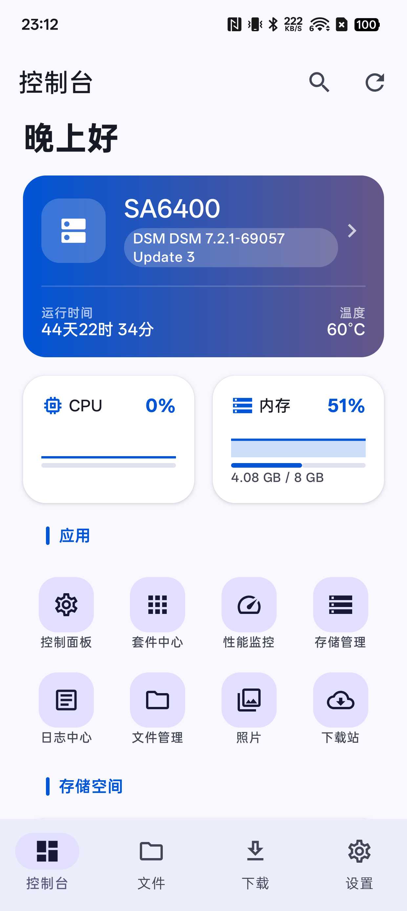
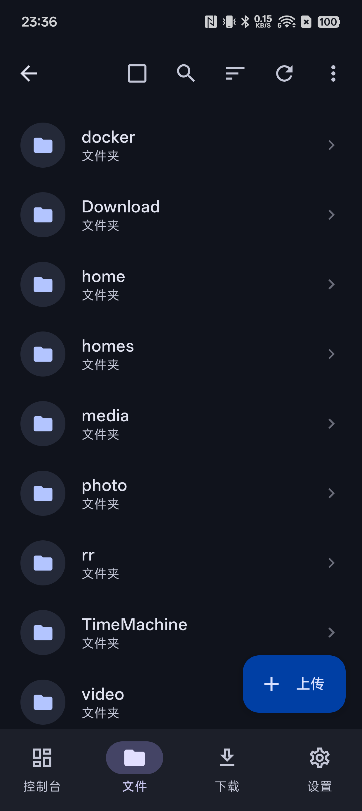
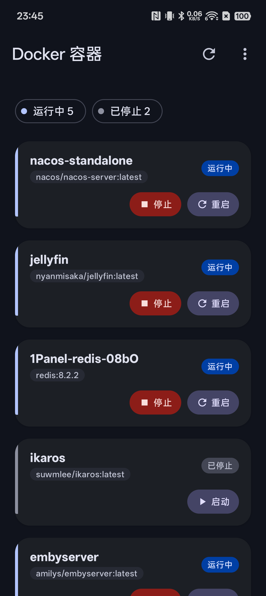
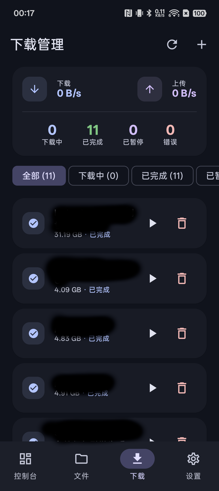
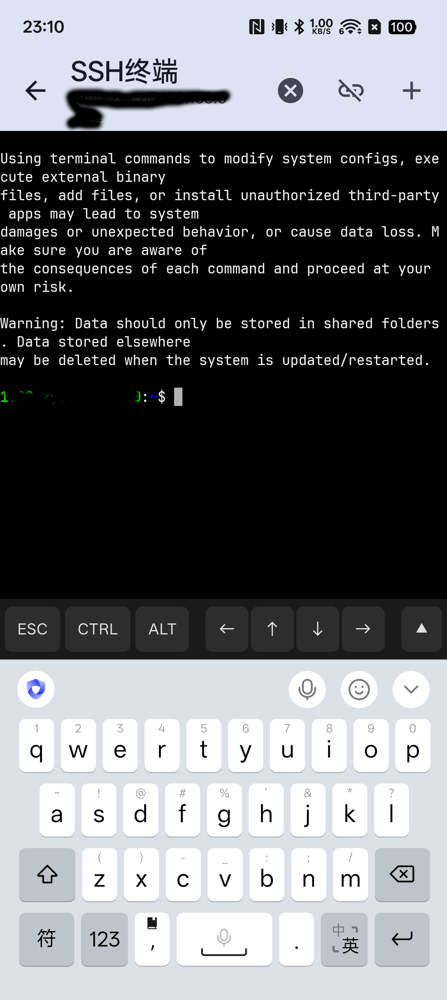

# DSM - Synology DSM Android 客户端

[](https://www.android.com/)
[](https://kotlinlang.org/)
[](https://developer.android.com/jetpack/compose)
[](LICENSE)

一个功能完整的 Synology DSM Android 客户端应用，为你提供便捷的移动端 NAS 管理体验。



---

## ✨ 功能特性

### 📊 系统监控
- 实时仪表盘（CPU、内存、网络、存储使用率）
- 系统资源性能图表
- 存储池与卷状态监控

### 📁 文件管理
- 浏览、上传、下载 DSM 文件
- 文件分享与权限管理
- 支持 GIF 预览

### 📸 照片管理
- 相册浏览与照片预览
- 支持缩放查看（Telephoto）
- 照片详情查看

### ⬇️ 下载站
- Download Station 任务管理
- BT/磁力链接添加
- 下载进度实时监控

### 🐳 Docker 管理
- 容器列表与状态查看
- 容器启动/停止/重启
- 容器日志查看

### 🎛️ 控制面板
- 用户与群组管理
- 共享文件夹管理
- 网络与存储设置
- 系统信息查看

### 💻 SSH 终端
- 内置 SSH 客户端
- 完整 VT100/xterm 终端模拟
- 移动端命令行管理

### 🎬 媒体播放
- 内置视频播放器（MPV）
- 支持多种视频格式
- 可缩放进度条控制

### 🔐 安全特性
- 加密存储敏感信息
- 支持自签名 SSL 证书

---

## 📱 截图

| 仪表盘 | 文件管理 | 照片浏览 |
|:------:|:--------:|:--------:|
|  |  |  |

| Docker | 下载站 | SSH 终端 |
|:------:|:------:|:--------:|
|  |  |  |

---

## 🛠️ 技术栈

| 类别 | 技术 | 版本 |
|------|------|------|
| **语言** | Kotlin | 2.3.10 |
| **UI 框架** | Jetpack Compose | BOM 2026.02.01 |
| **架构** | MVI (Model-View-Intent) | - |
| **依赖注入** | Hilt | 2.58 |
| **网络** | Retrofit + OkHttp | 3.0.0 + 5.3.2 |
| **JSON** | Moshi | 1.15.2 |
| **图片** | Coil | 2.7.0 |
| **数据库** | Room | 2.7.0-alpha12 |
| **导航** | Navigation Compose | 2.9.7 |
| **图表** | Vico | 3.0.2 |
| **播放器** | MPV Android | 0.1.9 |
| **SSH** | ConnectBot | 2.2.43 |

**编译配置**：
- `compileSdk`: 36
- `targetSdk`: 35
- `minSdk`: 24 (Android 7.0)
- `JDK`: 17

---

## 📦 安装

### 自行编译

```bash
# 克隆项目
git clone https://github.com/zengye/DSM.git
cd DSM

# 调试版本
./gradlew assembleDebug

# 发布版本
./gradlew assembleRelease
```

APK 输出位置：`app/build/outputs/apk/release/`

---

## 🚀 使用指南

### 1. 连接 DSM

1. 确保设备与 DSM 服务器在同一网络（或已配置外网访问）
2. 打开应用，输入 DSM 地址（如 `http://192.168.1.100:5000`）
3. 使用 DSM 账户登录

### 2. 添加快捷方式

支持将常用功能（如特定文件夹、容器）添加到主屏幕快捷方式。

---

## 🏗️ 架构设计

采用 **MVI (Model-View-Intent)** 架构模式，每个功能模块包含：

```
FeatureModule/
├── Screen.kt       # Composable UI，接收 State 并发送 Intent
├── ViewModel.kt    # 处理 Intent 并更新 State
├── Intent.kt       # 密封类，定义所有用户意图
└── Event.kt        # 密封类，定义单次事件（导航、Toast）
```

### 架构分层

```
┌─────────────────────────────────────────┐
│           UI Layer (Compose)            │
│  Screen → ViewModel → Intent → Event    │
└─────────────────────────────────────────┘
                    ↓
┌─────────────────────────────────────────┐
│           Data Layer                    │
│  Repository → API → Database → DataStore│
└─────────────────────────────────────────┘
```

---

## 📂 项目结构

```
app/src/main/java/wang/zengye/dsm/
├── data/                      # 数据层
│   ├── api/                   # Retrofit API 接口
│   ├── model/                 # 数据模型
│   ├── repository/            # Repository
│   ├── database/              # Room 数据库
│   └── dao/                   # DAO 接口
├── ui/                        # UI 层
│   ├── dashboard/             # 仪表盘
│   ├── file/                  # 文件管理
│   ├── download/              # 下载站
│   ├── photos/                # 照片管理
│   ├── docker/                # Docker 管理
│   ├── control_panel/         # 控制面板
│   ├── login/                 # 登录
│   ├── settings/              # 设置
│   ├── components/            # 通用组件
│   └── theme/                 # 主题
├── navigation/                # 导航管理
├── di/                        # 依赖注入（Hilt）
├── util/                      # 工具类
├── terminal/                  # SSH 终端
├── service/                   # 后台服务
├── DSMApplication.kt          # Application
└── MainActivity.kt            # Activity
```

---

## 🧪 测试

```bash
# 单元测试
./gradlew test

# UI 测试
./gradlew connectedAndroidTest

# 生成测试报告
./gradlew jacocoTestReport
```

---

## 📄 许可证

本项目采用 Apache 2.0 许可证 - 详见 [LICENSE](LICENSE) 文件

---

## 🙏 致谢

- [Jetpack Compose](https://developer.android.com/jetpack/compose)
- [Hilt](https://dagger.dev/hilt/)
- [Retrofit](https://square.github.io/retrofit/)
- [Coil](https://coil-kt.github.io/coil/)
- [Vico](https://github.com/patrykandpatrick/vico)
- [MPV Android](https://github.com/mpv-android/mpv-android)
- [ConnectBot](https://github.com/connectbot/connectbot)

---

**⭐ 如果这个项目对你有帮助，请给一个 Star！**
